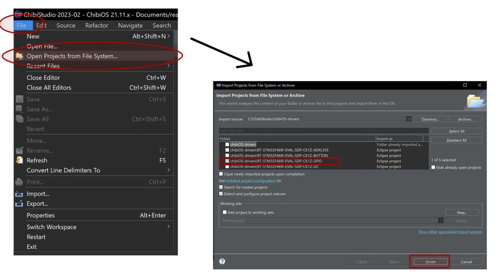
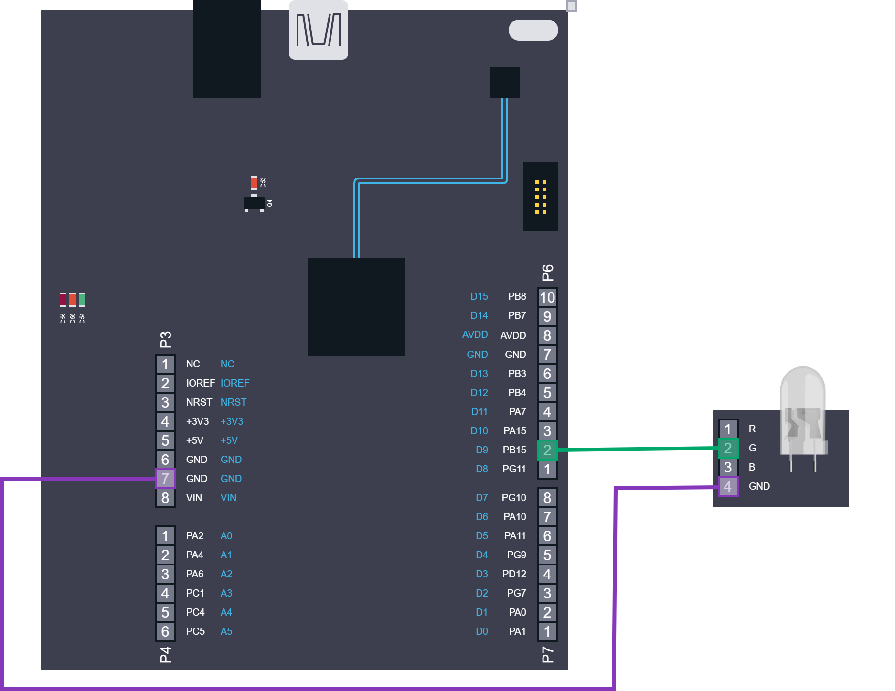
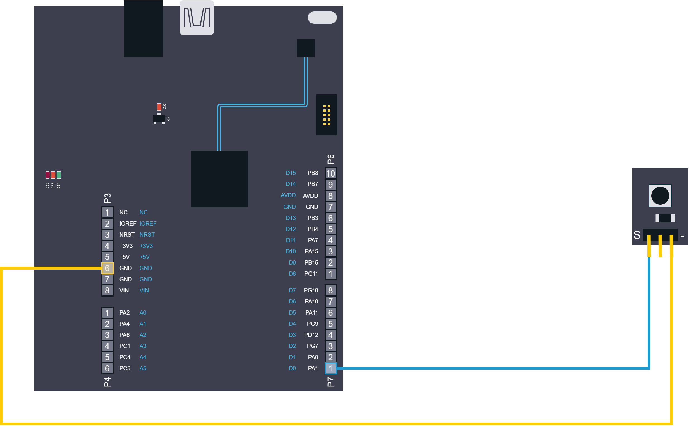
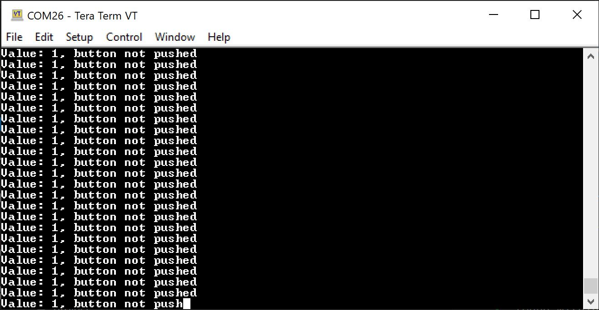
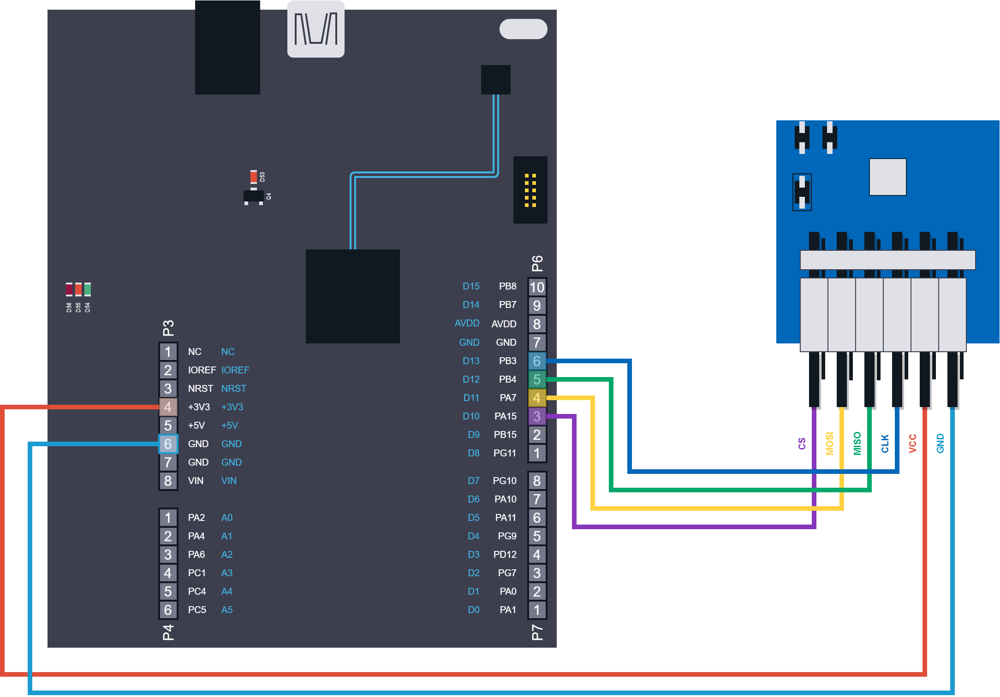
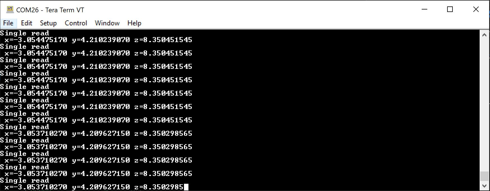

ChibiOS and no-OS drivers
===========================
# Table of contents
1. [Content](#content)
2. [Usage](#usage)
3. [Pre-requirements](#pre-req)
    1. [Sources and editor](#src-editor)
    2. [For testing](#testing)
4. [Projects](#project)
    1. [Open project](#open-project)
    1. [RT-STM32F469I-EVAL-SDP-CK1Z-GPIO](#gpio)
    1. [RT-STM32F469I-EVAL-SDP-CK1Z-BUTTON](#button)
    1. [RT-STM32F469I-EVAL-SDP-CK1Z-ADXL355](#adxl)
    1. [RT-STM32F469I-EVAL-SDP-CK1Z-I2C](#i2c)

## Usage: <a name="usage"></a>
1. Install ChibiOS: https://www.chibios.org/dokuwiki/doku.php
2. After extracting the OS, in the workspace add the directory examples and modify in the main Makefile the path towards os [```$(CHIBIOS)```] and the path toward no-os repository [```$(NOOS)```]

## Pre-requirements <a name="pre-req"></a>
### Sources and editor <a name="src-editor"></a>
* For system setup make sure to download ChibiOS from: https://sourceforge.net/projects/chibios/files/
and install it according to the provided guide.
* Download No-OS from https://github.com/analogdevicesinc/no-OS github repository. (Code -> Download ZIP) \
Alternatively by using the following command: 
```console 
git clone https://github.com/analogdevicesinc/no-OS.git
```

* Download and extract the provided examples from https://github.com/rbudai98/chibiOS-drivers (Code -> Download ZIP) and copy the project folders into ```C:/ChibiOS/``` \
Alternatively one can clone the repository directly into ```C:/ChibiOS/``` with command 
```console
git clone https://github.com/rbudai98/chibiOS-drivers.git
```
### For Testing <a name="testing"></a>
* For serial testing install [Putty](https://www.putty.org/) or [Terra Term](https://tera-term.en.softonic.com/).

## Projects <a name="project"></a>
### Opening Project: <a name="open-project"></a>
For source code editing and flashing the chibios studio framework is used. One can import any project at ```Files``` -> ```Open Project from File System``` -> Select workdir and project -> ```Finish```



### [RT-STM32F469I-EVAL-SDP-CK1Z-GPIO](https://github.com/rbudai98/chibiOS-drivers/tree/main/RT-STM32F469I-EVAL-SDP-CK1Z-GPIO) <a name="gpio"></a>

* Equipment:
    * board: [EVAL-SDP-CK1Z](https://www.analog.com/en/design-center/evaluation-hardware-and-software/evaluation-boards-kits/sdp-k1.html)
    * led, resistor and cables

* Wiring diagram:

    
* API:

Chibios provides a initalization structure for GPIO pins with properties (PORT, PAD and MODE):
```console
struct chibios_gpio_init_param chibios_gpio_extra_ip = {
  .port = GPIOB,
  .pad = 15U,
  .mode = PAL_MODE_OUTPUT_OPENDRAIN,
};
```
This init param has to be set properly first. After this it is linked to ```no_os_gpio_init_param``` structure via a pointer, found within the no_os api:

```console
struct no_os_gpio_init_param chibios_GPIO = {
  .platform_ops = &chibios_gpio_ops,
  .extra = &chibios_gpio_extra_ip,
};
```
In order to initialize the gpio pin:
```console
no_os_gpio_get(&gpio_desc, &chibios_GPIO);
```
After initialization the GPIO pin has been assigned the proper values and is ready to be used. To alternate the led:
```console
no_os_gpio_set_value(gpio_desc, PAL_LOW);
chThdSleepMilliseconds(1000);
no_os_gpio_set_value(gpio_desc, PAL_HIGH);
chThdSleepMilliseconds(1000);
```

### [RT-STM32F469I-EVAL-SDP-CK1Z-BUTTON](https://github.com/rbudai98/chibiOS-drivers/tree/main/RT-STM32F469I-EVAL-SDP-CK1Z-BUTTON) <a name="button"></a>

* Equipment:
    * board: [EVAL-SDP-CK1Z](https://www.analog.com/en/design-center/evaluation-hardware-and-software/evaluation-boards-kits/sdp-k1.html)
    * button and cables

* Wiring diagram:

    
* API:

Chibios provides a initalization structure for GPIO pins with properties (PORT, PAD and MODE):
```console
struct chibios_gpio_init_param chibios_gpio_extra_ip_5 = {
  .port = GPIOA,
  .pad = 1U,
  .mode = PAL_MODE_OUTPUT_PUSHPULL,
};
```
This init param has to be set properly first. After this it is linked to ```no_os_gpio_init_param``` structure via a pointer, found within the no_os api:

```console
struct no_os_gpio_init_param chibios_GPIO_5 = {
  .platform_ops = &chibios_gpio_ops,
  .extra = &chibios_gpio_extra_ip_5,
};
```
In order to initialize the gpio pin:
```console
no_os_gpio_get(&gpio_desc_5, &chibios_GPIO_5);
```
After initialization the GPIO pin has been assigned the proper values and is ready to be used. To read it's value an extra variable is declared, as follows:
```console
uint8_t tmp;
no_os_gpio_get_value(gpio_desc_5, &tmp);
```
The serial output looks like the following (Baudrate: ```38400```) :



### [RT-STM32F469I-EVAL-SDP-CK1Z-ADXL355](https://github.com/rbudai98/chibiOS-drivers/tree/main/RT-STM32F469I-EVAL-SDP-CK1Z-ADXL355) <a name="adxl"></a>

* Equipment:
    * board: [EVAL-SDP-CK1Z](https://www.analog.com/en/design-center/evaluation-hardware-and-software/evaluation-boards-kits/sdp-k1.html)
    * sensor: [ADXL3558](https://wiki.analog.com/resources/eval/user-guides/eval-adicup360/hardware/adxl355)
    * cables

* Wiring diagram:

    
* API:

Chibios offers a the SPI initialization parameter:
```console
SPIConfig spicfg = {
  .circular         = false,
  .slave            = false,
  .data_cb          = NULL,
  .error_cb         = NULL,
  .ssline           = LINE_ARD_D10,
  .cr1              = SPI_CR1_BR_2,
  .cr2              = 0
};
```

The previous configuration is assigned to the no-os initialization parameter structure:
```console
struct chibios_spi_init_param chibios_spi_extra_ip  = {
   .hspi=&SPID1,
   .spicfg=&spicfg,
};
```
This configuration is later linked to the No-Os API through the ```no_os_spi_init_param```-> ```extra```:
```console
struct no_os_spi_init_param adxl355_spi_ip = {
    .platform_ops = &chibios_spi_ops,
    .extra = &chibios_spi_extra_ip,
};
```

Later these setting are assigned to the device descriptor in the following line:
```console
  adxl355_ip.comm_init.spi_init = adxl355_spi_ip;
```

Before using the device drive we have to assign the appropriate variables for the device's initialization parameter:
```console
struct adxl355_init_param adxl355_ip = {
    .comm_type = ADXL355_SPI_COMM,
    .dev_type = ID_ADXL355,
};

```

After having the appropriate settings, we can initialize the driver, read-write registers and obtain data:
```console
  ret = adxl355_init(&adxl355_desc, adxl355_ip);
  if (ret)
      goto error;
  ret = adxl355_soft_reset(adxl355_desc);
  if (ret)
      goto error;
  ret = adxl355_set_odr_lpf(adxl355_desc, ADXL355_ODR_3_906HZ);
  if (ret)
      goto error;
  ret = adxl355_set_op_mode(adxl355_desc, ADXL355_MEAS_TEMP_ON_DRDY_OFF);
  if (ret)
      goto error;

  sdStart(&SD5, NULL);

  while(1) {
      ret = adxl355_get_xyz(adxl355_desc,&x[0], &y[0], &z[0]);
  }
  
error:
  return 0;
```


The serial output looks like the following (Baudrate: ```38400```) :



### [RT-STM32F469I-EVAL-SDP-CK1Z-I2C](https://github.com/rbudai98/chibiOS-drivers/tree/main/RT-STM32F469I-EVAL-SDP-CK1Z-I2C) <a name="i2c"></a>
